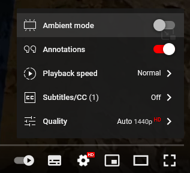
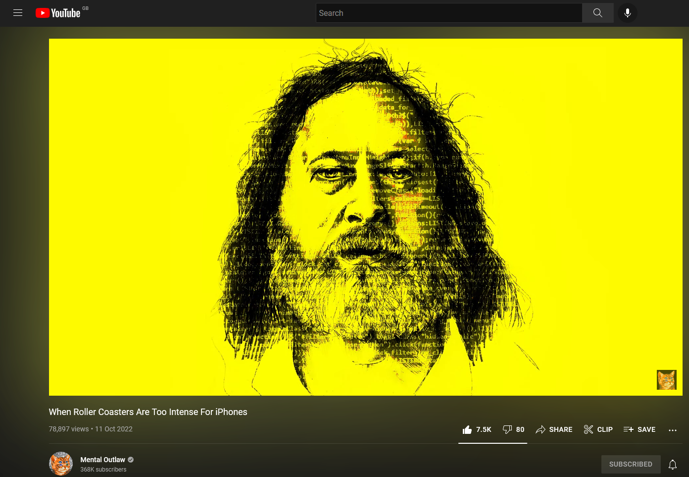
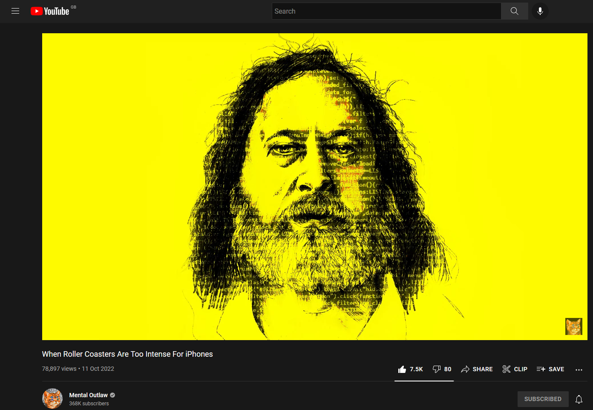

<h1 align="center">Remove YouTube Video Blur</h1>

Small extension that removes that annoying and distracting blur that occurs in YouTube's new interface change

**Depreciation! This addon is no longer needed:** YouTube has started to push this effect on more users but they have now added a setting to disable this (*finally*), therefore I am archiving this repo, this addon was meant for the people who had this feature forced on without a option to even turn it off

[Download directly from addons.mozilla.org](https://addons.mozilla.org/en-GB/firefox/addon/remove-youtube-video-blur/)

## Before & After

 </h1>

*[Video in the screenshots](https://www.youtube.com/watch?v=DLCDhj6GccY)*
